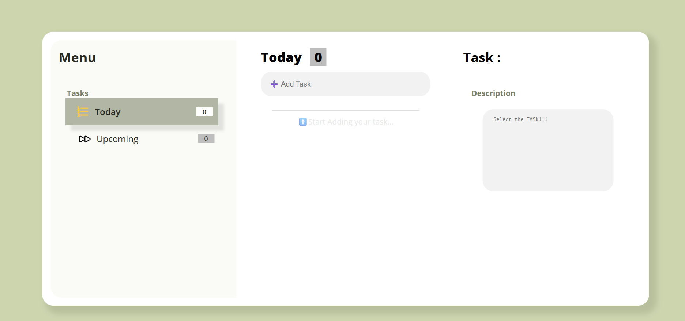
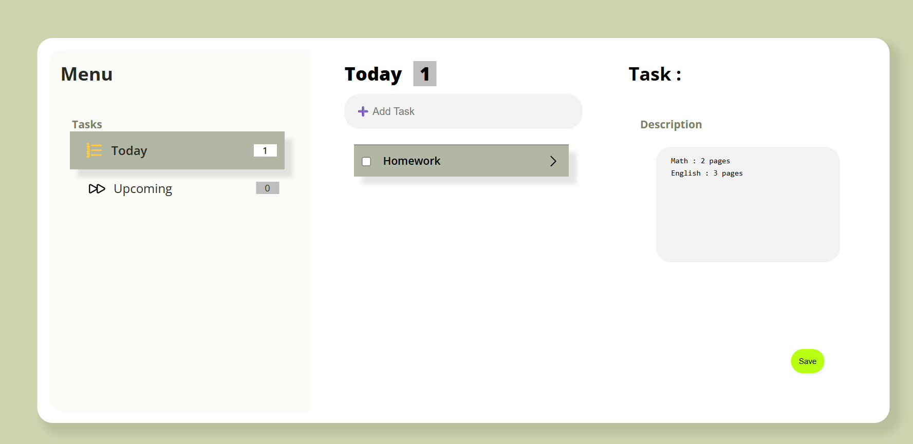

#📃 Task-To-Do App

A simple task listing web application built with **React**. You can start to create, view, describe, when completed, you can also delete task which considered as removed that task. Moreover, you can change your describe of each tasks each you like.

---

## 🚀 Features

In the project directory, you can :

- Add and delete tasks
- Categorize task by "Today" and "Upcoming" (tangible on update)
- Add details descriptions for each task as you like
- Autosave task using 'localStorage'

---

## 💻 Tech Stack

- React
- JavaScript (ES6+)
- HTML5 & CSS3
- Local Storage API

---

## Getting

### 1. Clone this repo

### 2. Install depedencies

-using npm install

### 3. Run the app

-npm start

---

##🧪 Build for Production

--npm run build

---

📸 Screenshots

---
